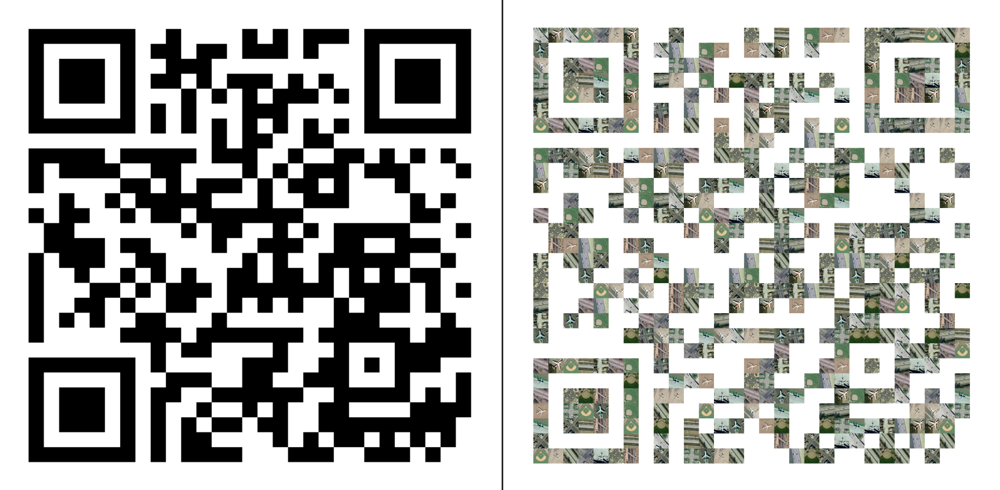

# QR picturizer (fun project - experimental)

Picturize QR codes with your own pictures!
Use either existing codes or create them on-the-fly from links or text and picturize them with your pictures.



## Prerequisites

- [Mamba](https://mamba.readthedocs.io/en/latest/index.html) (recommended) or [Conda](https://docs.conda.io/en/latest/)

## Installation

**1. Download this repository**

```console
$ git clone https://github.com/GrHalbgott/qr_picturizer.git
$ cd qr-picturizer
```

**2. Setup new virtual environment with all necessary dependencies**

```console
$ [mamba or conda] env create -f environment.yml
$ [mamba or conda] activate qr-picturizer
$ poetry install
```
Poetry will detect and respect an existing virtual environment that has been externally activated and will install the dependencies into that environment.

To update the packages to their latest suitable versions (and the poetry.lock file), run:
```console
$ poetry update
```

## Data/Images

You can either provide a generated QR code or create one using text (see [run program](./README.md#run-program)).
In both cases a QR code has to be in the `data` folder.
The name can be specified in the [params file](./config/params.yaml).

## Run program

**Usage**:

```console
$ python src/main.py -h

usage: main.py [-h] [-pic]

Picturize QR codes with your own pictures! Just specify if you want to use your own QR code or create one.

options:
  -h, --help  show this help message and exit
  -pic        Flag | Use if you provide a QR code, otherwise create one. Default: False
```

If no arguments are found, you are requested to put in a string via input command.

---

## Footnotes

Used dataset:
Yi Yang and Shawn Newsam, "Bag-Of-Visual-Words and Spatial Extensions for Land-Use Classification," ACM SIGSPATIAL International Conference on Advances in Geographic Information Systems (ACM GIS), 2010.
